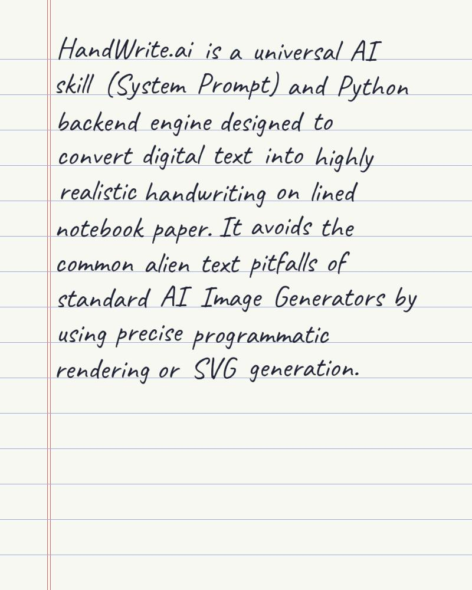

<div align="center">
  <h1>✍️ HandWrite.ai</h1>
  <p><b>A Universal AI Skill & Python Engine for Hyper-Realistic Handwriting Generation</b></p>
  
  [](https://opensource.org/licenses/MIT)
  [](https://python.org)
  [](https://python-pillow.org/)
</div>

<br/>


*Preview: HandWrite.ai accurately simulating human jitter, ink bleed, and natural word spacing on lined paper.*

---

## 📖 About The Project

Standard AI Image Generators (like DALL-E or Midjourney) notoriously struggle with long text—often producing "alien" glyphs instead of readable words. **HandWrite.ai** solves this by combining the conversational intelligence of LLMs with a deterministic, programmatic rendering engine.

It consists of two parts:
1. **The System Prompt:** A strict conversational state-machine prompt that forces LLMs (ChatGPT, Claude, etc.) to collect 6 styling parameters from the user before execution.
2. **The Rendering Engine:** A Python backend (`Pillow`-based) that generates highly realistic handwriting on notebook paper, featuring dynamic word spacing, Y-axis jitter, and micro-ink-blur to break the "computer font" illusion.

## ✨ Features

- **Strict Interactive Mode**: Prevents LLMs from prematurely executing code and making incorrect assumptions.
- **Human Imperfection Engine**: Injects random micro-variations (X-axis spacing and Y-axis jitter) for every single word.
- **Micro-Blur Ink Dynamics**: Simulates the natural bleeding of pen ink onto paper fibers.
- **Notebook Paper Generator**: Procedurally generates off-white paper with double-lined red margins and blue writing lines.
- **6 Customization Parameters**: Complete control over Style, Size, Slant, Pressure, Shape, and Spacing.

## 🚀 Installation

Ensure you have Python 3.8+ installed.

```bash
# Clone the repository
git clone https://github.com/wahyunuriman999/HandWrite.ai-Skill.git
cd HandWrite.ai-Skill

# Install the required image processing library
pip install -r requirements.txt
```

## 💻 Usage

### 1. As an LLM Skill (Custom GPTs / Prompts)
Copy the contents of `prompts/SYSTEM_PROMPT.md` and paste it into your Custom GPT's Instructions or send it as the first message to any AI chatbot. This empowers the AI to act as a frontend interface for collecting handwriting styles.

### 2. Using the Python Engine Locally
You can test the rendering engine directly without an LLM.

```bash
# Run the interactive CLI demo
python examples/demo_advanced.py
```

### 3. Integrating into your own Bot (Telegram/WhatsApp)
Import the core engine into your backend:

```python
from engine.core import render_handwriting

text = "Hello world! This is my generated handwriting."
options = {
    'gaya': '2', 'ukuran': '2', 'miring': '3',
    'tekanan': '1', 'bentuk': '1', 'spasi': '2'
}

output_file = render_handwriting(text, options, output_path="my_note.jpg")
```

## 🏗️ Architecture

```text
HandWrite.ai-Skill/
├── assets/                  # Preview images and downloaded fonts
├── engine/                  # Core Rendering Engine
│   ├── config.py            # Parameter validation and defaults mapping
│   └── core.py              # Procedural paper & typography rendering
├── examples/                # Quickstart scripts
│   ├── demo_basic.py        
│   └── demo_advanced.py     
├── prompts/                 
│   └── SYSTEM_PROMPT.md     # The Master System Prompt (Strict Mode)
├── CHANGELOG.md             # Release history
├── LICENSE                  # MIT License
└── requirements.txt         # Dependencies
```

## 📝 Configuration (The 6 Parameters)

The engine accepts a dictionary of 6 string-based flags (mapped 1-to-3):
1. **Gaya (Base Style):** Print, Cursive, Mixed, Calligraphy.
2. **Ukuran (Size):** Scales font size relative to line spacing.
3. **Kemiringan (Slant):** Adjusts the italic angle.
4. **Tekanan (Pressure):** Simulates heavy ink by multi-pass offset rendering.
5. **Bentuk (Shape):** Rounded vs Pointed characteristics.
6. **Spasi (Spacing):** Alters the base line height of the procedural paper.

## 📄 License

Distributed under the MIT License. See `LICENSE` for more information.
